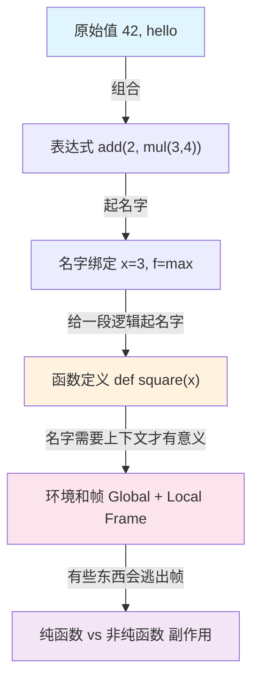

# Lecture 2 · Functions —— 计算机怎么理解你写的代码

> [!abstract] 这节课回答的总问题
> 你写下 `add(2, 3)`,计算机怎么知道这是什么意思?整节课都在回答这一件事。
>
> **世界观层面**:CS61A 第一节课从最底层建立一套世界观——语言如何表达想法,计算机如何执行这些想法。

## 配套资源

- 视频:cs61a.org → Calendar → Week 1(Functions / Names / Environment Diagrams,各 5-10 分钟)
- 教材:Composing Programs Ch.1.2(Elements of Programming)、Ch.1.3(Defining New Functions)、Ch.1.4 默认参数/docstring
- 作业:HW01(a_plus_abs_b / two_of_three / largest_factor / hailstone)
- 可视化工具:[pythontutor.com](https://pythontutor.com)(看帧的创建与消失)

## 知识脉络(分层推进 + 层间桥梁)



### 第一层:编程语言的三个基本能力

教材开头的三件事,贯穿整门课——递归、高阶函数、OOP 都是这三件事的延伸:

1. **原始表达式**(primitive):`42`、`max`——语言里最基本的数据和内置
2. **组合方式**(combination):`add(2, mul(3, 4))`——把简单的拼成复杂的
3. **抽象方式**(abstraction):给东西**起名字**——这是抽象的起点

> [!bridge] 桥 1→2
> 有了组合能力,下一个问题就是——这么复杂的表达式,先算哪个?

### 第二层:表达式和调用表达式

- **调用表达式**(call expression)结构:`operator(operand1, operand2)`
- **求值两步**:先对 operator 和所有 operand 求值,再把函数应用到参数
- 嵌套从内到外,**像拆洋葱**:`sub(pow(2, add(1,10)), pow(2,5)) = 2016`
- 表达式树可视化

> [!bridge] 桥 2→3
> 表达式里的名字(如 `radius`)是什么意思?需要给东西起名字 → 抽象的起点。

### 第三层:名字和环境——抽象的起点

- `=` 不是"等于",是**绑定**
- 关键认知:名字可以绑定到**函数本身**(`f = max`;`max = 5` 会覆盖)
- 所有绑定关系存在**环境**里

> [!bridge] 桥 3→4
> 赋值是把名字绑定到值,那能不能把名字绑定到"一段逻辑"?→ 更强大的抽象。

### 第四层:定义函数——更强大的抽象

- 函数定义 = 把名字绑定到一段逻辑
- **三件事**:创建函数对象、绑定名字、函数体此时**不执行**只存起来
- 函数签名 `square(x)`

> [!bridge] 关键桥 4→5 — Jace 在这一步亲自逼出来的问题
> 学完函数定义之后,有个更根本的问题浮出来:`square(5)` 被调用时,Python 怎么知道 `x` 是 5?`x` 只是个名字,本身没有任何意义——它的意义来自"此刻我们在哪个上下文里"。这就是为什么需要**环境**这个正式模型:它是 Python 用来回答"这个名字现在是什么意思"的机制。

> [!quote] L 阶段打磨记录
> Claude 第一版笔记只写"变量不冲突"作为第五层动机,Jace 反驳"这只是其中一个特殊情况的解释,我所理解的应该是为什么会有这个环境图才对"。Claude 重写,把根因改为**名字需要上下文才有意义**。

### 第五层:环境和帧——名字需要上下文才有意义

- **全局帧**:程序启动一直存在
- **本地帧**:每次调用临时创建,结束消失
- **查找规则**:先本地帧,再全局帧
- **环境图**(Environment Diagram):把这个过程画出来的工具

> [!bridge] 关键桥 5→6 — Jace 指出突兀后重写的
> 本地帧里的东西,函数结束后就消失了,不会影响外面。但 `print("hi")` 执行完之后,屏幕上的字消失了吗?没有。这说明有些函数做的事不只是在本地帧里算个值,它们还改变了外部世界——这种改变叫**副作用**。

> [!quote] L 阶段打磨记录
> Jace 指出"第五层到第六层过渡突兀,我都没法串联起来"。Claude 用"帧消失但屏幕上的字还在"作为桥梁,把副作用定义为**逃出帧的东西**——这个连接让 Jace 确认"有了,整体整理下吧"。

### 第六层:纯函数 vs 非纯函数——有些东西会逃出帧

- **纯函数**:作用都在本地帧里,只返回值
- **非纯函数**:还产生副作用(打印、写文件、改外部状态)
- 经典坑:`print(print(1), print(2))` 输出 `1` / `2` / `None None`(print 返回 None)
- **为什么区分**:纯函数更易测试、组合、不易 bug;后面函数式编程的核心

### 做作业必备:Python 语法与实用工具

> [!quote] L 阶段打磨记录
> Jace 说"课程结尾讲了些乱七八糟的玩意儿也没解释"。Claude 补写这一节,说明这些东西不是真的杂——都是学完函数后**马上要用到的实践工具**,HW01 直接就考。

| 工具 | 本质 | 代码 |
|---|---|---|
| 运算符 | 调用表达式的简写 | `2+3` = `add(2,3)` |
| [[元组拆包]] | 赋值的扩展(一次绑定多个名字) | `a, b = 1, 2` |
| 默认参数 | 函数签名的扩展 | `def f(x, y=10)` |
| 终端命令 | 跑代码必须会 | `python3 -i file.py` |
| [[Doctest]] | HW01 标配(`>>>` 自动验证) | `python3 -m doctest -v` |

## 我的理解(费曼推导链,保留原话)

> [!info] I 阶段说明
> Claude 扮演不懂编程的人,一次只问一个问题,等 Jace 回答后再追问。目标是逼 Jace 把每个概念从头推导出来。以下是完整问答链:

**Q: 函数是什么?**

> Jace:"函数就是一种对表达式的组合"

追问"为什么组合起来?直接每次写出来不行吗?"

> Jace:"不用重复造轮子 比如 一个平方的操作 不用每次都写好几行 直接调用平方代码就可以"

追问"怎么知道调用的是你写的平方,还是别人写的?"

> Jace:"通过命名的方式 不管是当前文件里写的平方 还是import进来的平方 在当前环境里都是有命名的"

**Q: 平方函数怎么知道要对哪个数字平方?**

> Jace:"要给上入参"

追问"入参在哪一步传进去?定义的时候还是调用的时候?"

> Jace:"调用"

追问"`def square(x)` 里的 `x` 是什么?它还不是一个具体的数字。"

> Jace:"是个占位符"

**Q: Python 怎么记录这个替换的?它怎么知道在 `square` 里面 `x` 现在是 5?**

> Jace:"用的帧"

追问"那这个帧,用完之后去哪了?"

> Jace:"用完就消除"

**Q: 函数执行时做的所有事,也跟着帧一起消失了吗?**

> Jace:"不会 会放会给调用的环境"

追问"`print("hi")` 执行完,它给调用它的地方返回了什么?"

> Jace:"None"

追问"那屏幕上那行字是怎么出现的?"

> Jace:"副作用"

追问"副作用和返回值,本质上有什么区别?"

> Jace:"一个是函数本身操作表达式要返回的信息 另一个就是额外产生的非表达式的产物"

追问"从帧的角度来说,副作用发生在哪里?"

> [!tip] 关键啊哈
> **Jace:"副作用发生在帧外面"**

---

**推导链收敛**(Claude 总结,Jace 确认):

函数是把一段逻辑抽象出来,给它起名字,并且允许接受不同的输入。好处是同一段逻辑不用重复写,传不同的入参就能得到不同的结果。

调用时把入参传进去,`def` 里的 `x` 只是占位符,调用时才绑定到具体值。Python 创建一个本地帧记录这个绑定,函数结束帧消失,返回值传回调用者。

帧消失了,但 `print("hi")` 的字还在——那行字不是通过返回值传出来的(`print` 返回 `None`),它直接发生在帧外面。**返回值在帧里产生,沿着调用链传回去;副作用直接发生在帧外面,不受帧的生命周期限制。** 只有返回值的叫纯函数,还有副作用的叫非纯函数。

---

> [!warning] Claude 主动纠正
> Jace 第一版说"函数是给一段逻辑起名字"——但如果只是起名字、没有参数,那函数永远只能做同一件事,和变量没区别。函数真正强大的地方是**命名 + 参数**的组合:同一段逻辑可以作用在不同输入上,`square(2)` 和 `square(5)` 用同一逻辑,入参不同结果不同。

### 推导问答速查表

| 提问 | Jace 的回答 |
|---|---|
| 什么是函数? | "函数就是一种对表达式的组合" |
| 为什么组合起来? | "不用重复造轮子,直接调用平方代码就可以" |
| 怎么知道调用的是哪个平方? | "通过命名,在当前环境里都是有命名的" |
| 平方函数怎么知道对哪个数字平方? | "要给上入参" |
| 入参在哪一步传进去? | "调用" |
| `def square(x)` 里的 x 是什么? | "是个占位符" |
| Python 怎么记录 x 现在是 5? | "用的帧" |
| 帧用完去哪了? | "用完就消除" |
| 函数执行时做的事也跟着消失吗? | "不会,会给调用的环境" |
| `print("hi")` 返回什么? | "None" |
| 屏幕上那行字怎么出现的? | "副作用" |
| 副作用和返回值本质区别? | "一个是函数本身操作表达式要返回的信息,另一个是额外产生的非表达式的产物" |
| 从帧的角度,副作用发生在哪里? | **"副作用发生在帧外面"** ← 关键啊哈 |

## Java 桥梁

- **函数 vs method**:Python 的函数和 Java 的 method 本质一样——把一段逻辑封装起来,给它一个名字,反复调用。不同的是 Python 不需要声明类型,直接 `def` 就能写;Python 的函数本身也是一个值,可以赋值给变量。
- **类型绑定**:Java `int x = 3` 类型固定;Python `x = 3` 只是标签,随时指向别的东西(更接近"贴便利贴")。
- **作用域 vs 环境**:Java 叫 scope,Python 叫 environment/frame——概念一样,但 CS61A 用环境图让你**看见**这个过程,而不是默默依赖编译器帮你管。
- **为什么用 Python 教**:Java 里这些都是隐式的,编译器帮你管;Python 把这些全部暴露出来让你看见——这就是为什么 CS61A 用 Python 教,不用 Java。
- **副作用重新审视**:你在 Java 里写的很多方法其实是非纯的(有副作用),这门课让你重新审视这件事。
- **中缀 vs 函数形式**:Java 用 `a + b * c`,Python 也支持,但 CS61A 刻意先用函数形式 `add(a, mul(b, c))` 教,是为了让你看清楚求值的层级结构。

## HW01 答题过程(苏格拉底式,记录推导与纠错)

### Q1: a_plus_abs_b

**题目**:填空,`b < 0` 时 `f = _____`,`b >= 0` 时 `f = _____`,使 `return f(a, b)` 等于 `a + abs(b)` 但不能调用 `abs`。

**推导路径**:
1. Claude 指 `return f(a, b)` 问"f 是值还是什么?" → "函数"
2. 问 b<0 时 `a+abs(b)` 等于什么 → "a-b"

   > [!note] 纠错笔记
   > b<0 时,abs(b) = -b,所以 a + abs(b) = a + (-b) = a - b,用 `sub`;b>=0 时,abs(b) = b,所以 a + abs(b) = a + b,用 `add`。
3. 问 f 要等于 a-b,f 是哪个函数 → **Jace 犯错:"reduce?"**
4. **纠错**:Claude 提醒题目开头提到 `operator` 模块 → "哦哦 sub"
5. b>=0 → "add"

**答案**:`f = sub`(b<0) / `f = add`(b>=0)
**思路**:把函数本身当值赋给 f,体现了"函数也是值"这一 Week 1 核心认知。

### Q2: two_of_three

**题目**:三个正数,返回最小两个的平方和,一行搞定。

**推导路径**:
1. 三数平方和 → "i*i + j*j + k*k"
2. 减什么等于最小两个的平方和 → "减去最大的数的平方"
3. 最大数怎么拿 → "max(i,j,k)"
4. **Jace 的啊哈**:"我靠为什么想到是这种方式"
5. **通用思路**(Claude):**与其找你要的,不如找你不要的,再减掉。** "找'最小两个'很麻烦,但找'最大那个'只要一个 max 就搞定。"
6. Jace 反驳:"找俩个小的很麻烦么" → Claude 承认并展示替代方案 `min(i*i+j*j, j*j+k*k, i*i+k*k)`,说明"全部减最大"扩展性更好(四五个数也能用)
7. **Jace 自主洞察**:**"我发现如果要想一行,在步骤上就不能存在依赖性"** ← 不在课本里

**答案**:`return i*i + j*j + k*k - max(i,j,k)*max(i,j,k)`

> [!tip] Jace 的啊哈
> 想到"全部减最大"这种逆向思路;自主推出"一行代码不能有步骤依赖"。

> [!quote] Claude 延伸
> 你说的"步骤上不能有依赖性",更准确的说法是——**能不能把整个计算描述成一棵表达式树**。能的话就一行,不能的话就需要中间变量。CS61A 后面会越来越强调这种思维——不是"先做这个再做那个",而是"答案就是这个表达式"。Week 6 学高阶函数会更有感觉。

### Q3: largest_factor

**题目**:返回 n 的最大因数(小于 n 且能整除 n 的最大整数)。

**推导路径**:
1. 从哪个方向找 → "从最大找"
2. 从哪里开始 → "从 n 开始" → **纠错**:题目说因数要比 n 小 → "n-1"
3. 不知道怎么表达整除 → Claude 提示 `a % b == 0` → "n%i==0"
4. 写出 while 框架:

```python
i = n - 1
while i >= 1:
    if n % i == 0:
        return i
    i -= 1
return None
```

5. 末尾 `return None` 永远不执行 → Claude 问为什么 → "不知道" → "n 大于 1,n%1 等于多少?"(1 永远是因数,循环必在 i=1 命中)
6. Claude:"先跑过再说优化,别跳步骤" → Jace 跳过直接下一题(没真正跑)

**答案**:如上 while 循环,从 n-1 递减找到第一个能整除的即为最大因数。

> [!warning] 未跑的遗憾
> Jace 没有实际跑 doctest,Claude 标记"先跑过再说优化"。

### Q4: hailstone(纠错最多的一题)

**题目**:冰雹序列——n 为偶数则除以 2,为奇数则乘 3 加 1,直到变成 1。打印每一步并返回步数。

**推导路径与纠错**(共 5 处纠错):

| # | 纠错点 | 过程 |
|---|---|---|
| 1 | **偶数奇数逻辑写反** | Jace 把 if/else 两个分支都写反了(奇数写 `*3+1` 笔误成 `*3+2`,且奇偶分支互换) |
| 2 | **`/` vs `//`** | Claude 让试 `10/2` vs `10//2` → Jace:"一个是 float 一个是 int"。题目提示也说了用 `//` |
| 3 | **print 时机** | 第一个数应在变换前打印 → Jace 改为 while 外先 `print(n)` |
| 4 | **step 起始值** | 第一个数也算一步 → step 从 0 改为从 1 开始 |
| 5 | **n=1 边界** | n 一开始就是 1 时循环会走 `*3+1` → 把终止条件放进 `while n != 1`,n=1 时根本不进循环 |

**最终答案**:

```python
def hailstone(n):
    step = 1
    print(n)
    while n != 1:
        if n % 2:
            n = n * 3 + 1
        else:
            n = n // 2
        print(n)
        step += 1
    return step
```

**手动 trace 验证** n=10:
- step=1, 打印 10
- 10 偶 → n=5, 打印 5, step=2
- 5 奇 → n=16, 打印 16, step=3
- 16 偶 → n=8, 打印 8, step=4
- 8 偶 → n=4, 打印 4, step=5
- 4 偶 → n=2, 打印 2, step=6
- 2 偶 → n=1, 打印 1, step=7
- n==1 退出,返回 7 ✓

> [!warning] 仍漏改 `/` 为 `//`
> Claude 反复提醒"就这一个字符"才改对——细节执行力待提升。

## 关键纠错与突破

> [!abstract] Claude 主动纠正(L 阶段笔记打磨)
> 1. **第一版笔记只是堆砌知识点** → Jace 反弹"没有整体的感觉,我需要的是整体知识网络架构的感觉" → Claude 重写为分层叙事 + 层间桥梁结构
> 2. **第五层→第六层过渡突兀** → 重写桥梁(用"帧消失但屏幕上的字还在"连接副作用)
> 3. **第五层出现动机不足** → 把根因从"变量不冲突(只是结果)"改为"名字需要上下文才有意义"
> 4. **知识点遗漏** → Jace 说"怎么少了很多知识点?" → Claude 补齐主干+细节双层结构
> 5. **Markdown 格式** → Jace 指出代码块包裹导致 Obsidian 渲染乱 → Claude 改为纯 Markdown 输出
> 6. **函数定义漏掉参数化** → "命名+参数才是函数强大的地方"

> [!tip] Jace 的啊哈时刻
> - two_of_three 想通"全部减最大":"我靠为什么想到是这种方式"
> - **自主推出:"如果要想一行,在步骤上就不能存在依赖性"**(连接到表达式树/函数式编程,Week 6 学高阶函数会更有感觉)
> - **副作用本质:"副作用发生在帧外面"**(笔记化为"有些东西会逃出帧")
> - 结尾感受:"我去 我第一次觉得好像完成了很多 哇塞"

> [!quote] 收尾总结(Claude)
> "最重要的是你今天推导出了两个很有价值的东西:副作用就是'逃出帧的东西',以及'一行代码要求步骤之间没有依赖性'。这两个不在课本里,是你自己想到的。"

## 相关概念

- [[03 - Control]] — 函数体里能做什么?引入语句、条件、迭代,把环境模型补成完整执行模型
- [[04 - Higher-Order Functions]] — 函数本身能不能当值传?抽象能走多远
- [[05 - Environments]] — 把环境模型正式化成画图规则,机械地追踪闭包
